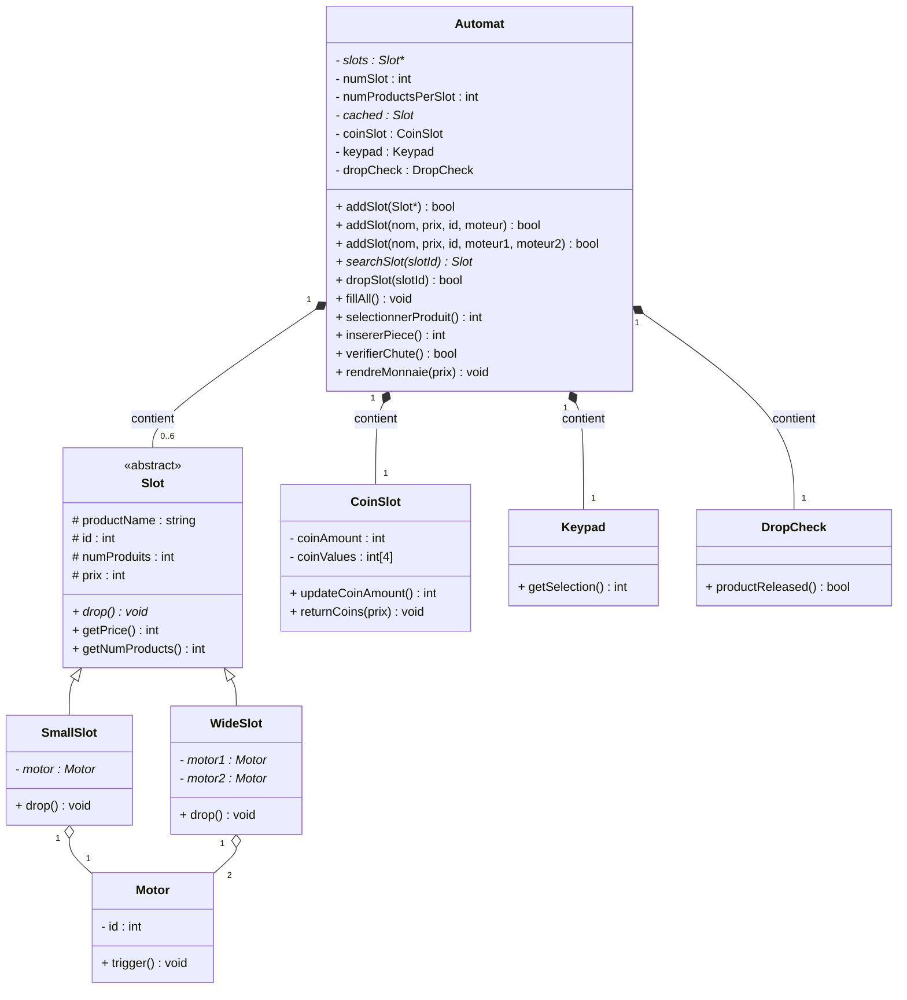
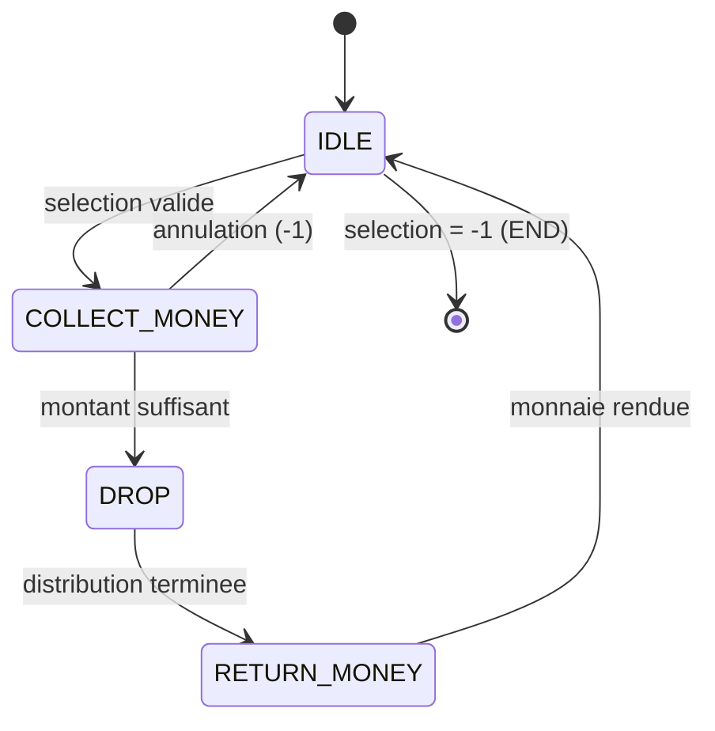

# 🍫 Snack Vending Machine Simulator (C++ / OOP)

Simulation console d'un distributeur automatique de snacks, développée en C++ dans le cadre d'un mini-projet de Programmation Orientée Objet. Le matériel (moteurs, monnayeur, clavier, capteurs infrarouges) est entièrement simulé — aucun composant physique n'est requis.

## Fonctionnalités

- **Sélection puis paiement** : l'utilisateur choisit un produit, insère des pièces jusqu'à atteindre le prix, puis récupère le produit et sa monnaie.
- **Machine à états** (`IDLE → COLLECT_MONEY → DROP → RETURN_MONEY`) pilotant tout le flux d'achat.
- **Détection de chute simulée** : un capteur infrarouge virtuel valide (90% de succès) que le produit est bien tombé, avec système de nouvelle tentative en cas d'échec.
- **Rendu de monnaie automatique** via un algorithme glouton sur les dénominations disponibles.
- **Mode administrateur** : ajout, modification et réapprovisionnement des emplacements.
- Deux types d'emplacements avec **héritage/polymorphisme** : `SmallSlot` (1 moteur) et `WideSlot` (2 moteurs).

## Diagramme de classes



`Slot` est une classe abstraite (`drop()` virtuelle pure) ; `SmallSlot` et `WideSlot` en héritent et implémentent chacune leur propre logique de distribution.

## Diagramme d'états (session client)



## Structure du projet

```
.
├── main.cpp          # Point d'entrée + machine à états + menus
├── Automat.h/.cpp     # Gestion du distributeur (emplacements, façade des composants)
├── Slot.h/.cpp        # Classe abstraite représentant un emplacement
├── SmallSlot.h/.cpp   # Emplacement à un seul moteur
├── WideSlot.h/.cpp    # Emplacement à deux moteurs
├── Motor.h/.cpp       # Simulation d'un moteur de spirale
├── CoinSlot.h/.cpp    # Monnayeur (insertion de pièces, rendu de monnaie)
├── Keypad.h/.cpp      # Clavier de sélection du produit
├── DropCheck.h/.cpp   # Capteur infrarouge simulé
└── Makefile
```

## Compilation et exécution

```bash
make
./distributeur
```

Ou directement avec g++ :

```bash
g++ -std=c++17 -Wall -Wextra -o distributeur main.cpp Automat.cpp Slot.cpp SmallSlot.cpp WideSlot.cpp Motor.cpp CoinSlot.cpp Keypad.cpp DropCheck.cpp
./distributeur
```

## Exemple d'exécution

```
===== SESSION CLIENT =====
+------+----------------------+----------+---------+
|  N   | Produit              | Prix     | Stock   |
+------+----------------------+----------+---------+
|    1 | Chips Nature         |      5   |      10 |
|    2 | Chocolat             |      8   |      10 |
+------+----------------------+----------+---------+
Numero de l'emplacement souhaite (-1 pour annuler) : 1
Prix du produit selectionne : 5 DH
Inserez une piece (10, 5, 2 ou 1 DH) ou -1 pour annuler : 10
Montant total insere : 10 DH (prix : 5 DH)

--- Distribution du produit ---
   [Moteur 101] rotation de la spirale...
   [Moteur 102] rotation de la spirale...
Produit detecte dans le bac de sortie.
Monnaie rendue (5 DH) :
  1 x 5 DH
```

## Concepts C++ mis en pratique

- Classes abstraites et méthodes virtuelles pures
- Héritage et polymorphisme
- Composition (Automat contient CoinSlot, Keypad, DropCheck)
- Surcharge de fonctions (`addSlot()`)
- Gestion manuelle de la mémoire (`new` / `delete`)
- `enum class` pour modéliser une machine à états

## Auteur

Rida — étudiant en Génie Informatique (GI1)
